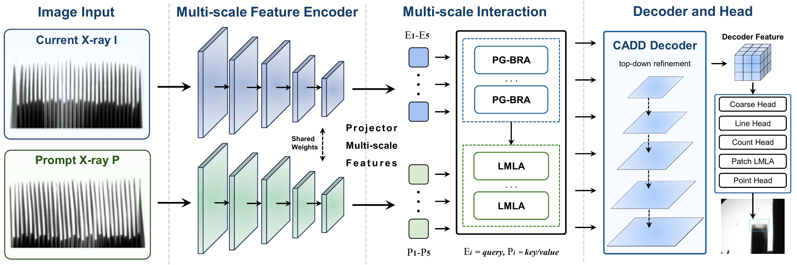

# EPRFormer

<p align="center">
  <b>面向动力电池 X-ray 极片端点检测的提示引导点级分割网络。</b>
</p>

<p align="center">
  <a href="README.md">English</a> |
  <a href="https://github.com/Xiaoqi-Zhao-DLUT/X-ray-PBD">PBD5K / X-ray-PBD</a> |
  <a href="CITATION.bib">引用</a>
</p>

EPRFormer 是一个可独立运行的 PyTorch 代码仓库，用于 PBD5K 场景下的动力电池 X-ray 极片端点检测。模型以点级分割方式预测正、负极端点响应图，并导出符合官方评测格式的 `.npy` 坐标文件。

本仓库包含最终模型代码、训练脚本、推理脚本、checkpoint 评估、导出结果评估、PBD 复用工具、手稿图和引用文件。运行本仓库不需要额外克隆 `X-ray-PBD`，相关的数据读取、连通域后处理和评测逻辑已经整理到 `utils/` 中。

<p align="center">
  
</p>

## 方法特点

EPRFormer 并不是把 PBD 简单当作通用检测或通用语义分割任务，而是围绕极片端点检测中的误差来源进行设计。

- **提示引导双层路由交叉注意力 PG-BRA**：先筛选相关提示区域，再执行 token 级交互，减少无关提示区域带来的干扰。
- **轻量多尺度线性注意力 LMLA**：在较低计算开销下建模密集端点的长距离排列关系。
- **内容感知细节解码器 CADD**：增强点图细节恢复能力，减小上采样导致的端点坐标偏移。
- **点图、线图和计数协同监督**：延续 PBD 中有效的多线索约束范式，提高数量一致性与定位稳定性。

## 仓库结构

```text
EPRFormer/
  model/
    eprformer.py              # 最终版 EPRFormer 模型
    __init__.py
  utils/
    eval_utils.py             # 官方风格 checkpoint 评估工具
    image_ops.py              # 图像预处理与连通域工具
    pbd_metrics.py            # PBD 端点评测指标
    __init__.py
  figures/                    # 手稿图
  train_eprformer.py          # 唯一训练入口
  infer_eprformer.py          # 推理与 npy 导出
  eval_checkpoint.py          # checkpoint 评估
  evaluate_predictions.py     # 导出预测文件评估
  requirements.txt
  CITATION.bib
```

## 环境安装

所有命令默认在仓库根目录运行。

请先根据本机 CUDA 或 CPU 环境安装 PyTorch：

```bash
# 示例命令，请根据实际 CUDA 版本选择对应安装方式。
pip install torch torchvision --index-url https://download.pytorch.org/whl/cu121
```

然后安装其余依赖：

```bash
pip install -r requirements.txt
```

推荐安装 `opencv-python` 以加速连通域后处理；如果不可用，代码会自动使用纯 Python 回退实现。

## 数据准备

PBD5K 数据集请从 X-ray-PBD 官方 release 下载：

https://github.com/Xiaoqi-Zhao-DLUT/X-ray-PBD/releases/tag/Dataset

训练数据建议组织为：

```text
data/train_data/
  img_crop/
  neg_point_mask_crop/
  pos_point_mask_crop/
  neg_line_mask_crop/
  pos_line_mask_crop/
```

官方风格评估数据建议组织为：

```text
data/PBD5K_test_data/
  img/
  mask/              # 或 crop_mask/，取决于你本地整理方式
  neg_location/
    all/
    regular/
    difficult/
    tough/
  pos_location/
    all/
    regular/
    difficult/
    tough/
```

所有路径都可以通过命令行参数覆盖。

## 快速开始

建议先运行 smoke test：

```bash
python train_eprformer.py \
  --device cuda \
  --image-size 64 \
  --batch-size 1 \
  --num-workers 0 \
  --smoke-test \
  --data-root data/train_data \
  --val-data-root data/PBD5K_test_data
```

训练最终模型：

```bash
python train_eprformer.py \
  --device cuda \
  --image-size 512 \
  --backbone resnet50d \
  --batch-size 4 \
  --num-workers 2 \
  --amp \
  --amp-dtype bf16 \
  --epochs 150 \
  --data-root data/train_data \
  --val-data-root data/PBD5K_test_data
```

默认输出目录：

```text
runs/eprformer/
  train.log
  metrics.csv
  latest.pth
  best.pth
  top_epochXXX_pnaccXXXX_cntmaeXXXX.pth
```

## Checkpoint 评估

```bash
python eval_checkpoint.py \
  --checkpoint runs/eprformer/best.pth \
  --val-data-root data/PBD5K_test_data \
  --official-eval-split all \
  --image-size 512 \
  --device cuda
```

输出指标包括 `AN-MAE`、`CN-MAE`、`AN-ACC`、`CN-ACC`、`PN-ACC`、`AL-MAE`、`CL-MAE` 和 `OH-MAE`。

## 推理

导出官方风格端点坐标文件：

```bash
python infer_eprformer.py \
  --checkpoint runs/eprformer/best.pth \
  --image-root data/PBD5K_test_data/img \
  --crop-mask-root data/PBD5K_test_data/mask \
  --output-root predictions \
  --image-size 512 \
  --device cuda
```

输出结构：

```text
predictions/
  neg_location/*.npy
  pos_location/*.npy
```

如需同时保存二值端点图，可加入 `--save-masks`。

## 导出结果评估

```bash
python evaluate_predictions.py \
  --prediction-root predictions \
  --gt-root data/PBD5K_test_data \
  --splits all regular difficult tough
```

## 致谢与第三方说明

EPRFormer 遵循 X-ray-PBD 提出的 PBD5K 任务设定。数据格式、端点检测任务定义和官方风格指标均参考上游项目。

- X-ray-PBD 仓库：https://github.com/Xiaoqi-Zhao-DLUT/X-ray-PBD
- PBD5K 数据集：https://github.com/Xiaoqi-Zhao-DLUT/X-ray-PBD/releases/tag/Dataset
- X-ray-PBD 模型权重：https://github.com/Xiaoqi-Zhao-DLUT/X-ray-PBD/releases/tag/Model_pth
- 基准论文：https://arxiv.org/pdf/2312.02528v2.pdf

本仓库运行所需的复用逻辑已经整理到 `utils/` 中。使用 PBD5K 数据或与 X-ray-PBD baseline 对比时，请遵循上游仓库关于数据、模型和代码的使用条款。

## 引用

如果本仓库对你的研究有帮助，请引用 PBD5K/X-ray-PBD benchmark 以及本项目。相关 BibTeX 条目见 `CITATION.bib`。
